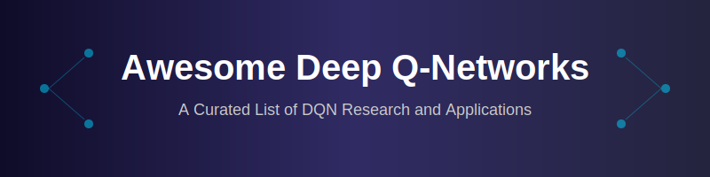

# 🧠 Awesome Deep Q-Networks (DQNs) 🚀

**A curated list of awesome Deep Q-Network (DQN) resources, papers, and implementations.**

[Introduction](#-deep-q-networks-dqns) • [Benchmark Examples](#-top-benchmark-examples) • [Core Resources](#-core-resources) • [Contributing](#-contributing)

---

## 📖 Deep-Q-Networks (DQNs)

Deep-Q-Networks (DQNs) blend **Reinforcement Learning** with **Deep Neural Networks**. They replace traditional Q-tables to solve complex, high-dimensional decision-making problems by interacting with environments and predicting future rewards.

  
  
<i>DQN mastering Atari Breakout through experience.</i>

## 🏆 Top Benchmark Examples

### 🕹️ Google DeepMind's Atari Agents
| Year | Paper | Deep Dive | Description |
| :--- | :--- | :--- | :--- |
| 2013 | [Playing Atari with Deep RL](https://arxiv.org/abs/1312.5602) | [Detailed Analysis](./details/atari-agents.md) | The foundational DQN breakthrough. Master classic Atari 2600 games at superhuman levels. |

### 🤖 Agent57
| Year | Paper | Deep Dive | Description |
| :--- | :--- | :--- | :--- |
| 2020 | [Agent57: Outperforming Atari](https://arxiv.org/abs/2003.13350) | [Detailed Analysis](./details/agent57.md) | Outperforms human benchmarks across all 57 tested Atari games, solving long-term planning. |

### ⚖️ Gymnasium Control Tasks (e.g., CartPole)
| Year | Paper | Deep Dive | Description |
| :--- | :--- | :--- | :--- |
| 2016 | [OpenAI Gym](https://arxiv.org/abs/1606.01540) | [Detailed Analysis](./details/cartpole.md) | Standard baseline where DQN learns to balance a pole. Perfect "Hello World" for RL. |

### 👥 Double DQN (DDQN)
| Year | Paper | Deep Dive | Description |
| :--- | :--- | :--- | :--- |
| 2015 | [Deep RL with Double Q-learning](https://arxiv.org/abs/1509.06461) | [Detailed Analysis](./details/double-dqn.md) | Mitigates over-estimation bias by using two networks for action selection and evaluation. |

### ⚔️ Dueling DQN
| Year | Paper | Deep Dive | Description |
| :--- | :--- | :--- | :--- |
| 2015 | [Dueling Network Architectures](https://arxiv.org/abs/1511.06581) | [Detailed Analysis](./details/dueling-dqn.md) | Splits network into state value and action advantage streams for better policy evaluation. |

## 📚 Core Resources

*   **📄 Research Paper:** [Playing Atari with Deep Reinforcement Learning](https://arxiv.org)
*   **💻 Code Implementation:** [Google DeepMind DQN Zoo Repository](https://github.com)

## 🤝 Contributing

Contributions are welcome! Please read the [contribution guidelines](CONTRIBUTING.md) (coming soon) first.

---

  Made with ❤️ by <a href="https://github.com/ishandutta2007">ishandutta2007</a>

