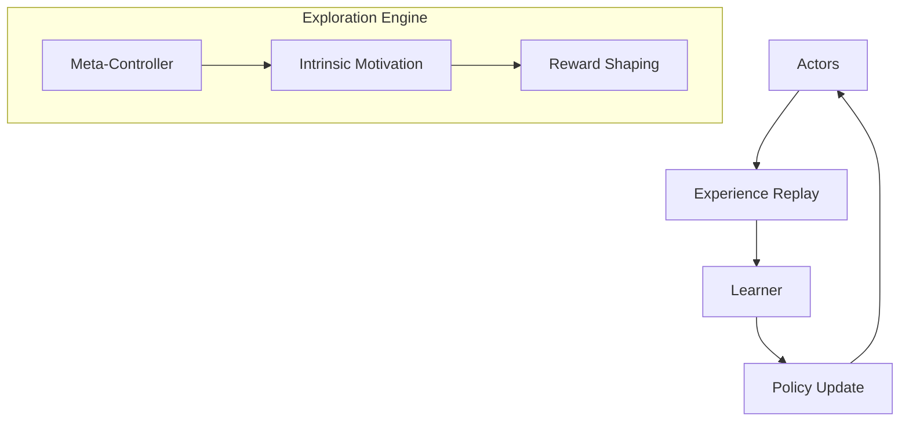

# Agent57

Agent57 is the first deep reinforcement learning agent to outperform the human benchmark on all 57 games in the Atari57 suite. It addresses long-standing challenges in RL: long-term credit assignment and exploration.

## Key Innovations
- **Never Give Up (NGU) Core:** Uses intrinsic rewards to encourage exploration.
- **Distributed Training:** Scales learning across many actors.
- **Meta-Controller:** Learns to choose which discount factors and exploration rates are best for a specific game.

## Architecture Diagram

## References
- [Agent57: Outperforming the Atari Human Benchmark (2020)](https://arxiv.org/abs/2003.13350)

[Back to README](../README.md)
