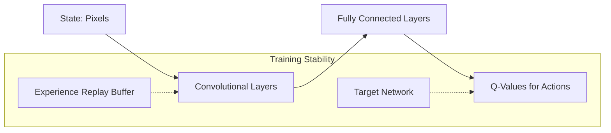

# Google DeepMind's Atari Agents (DQN)

The original Deep Q-Network (DQN) combined reinforcement learning with deep neural networks, specifically using Convolutional Neural Networks (CNNs) to process raw pixels from Atari 2600 games.

## Key Innovations
- **Experience Replay:** Storing transitions in a buffer and sampling them randomly to break correlations between consecutive samples.
- **Target Network:** Using a separate network to calculate target Q-values, updated periodically to stabilize training.

## Architecture Diagram

## References
- [Playing Atari with Deep Reinforcement Learning (2013)](https://arxiv.org/abs/1312.5602)
- [Human-level control through deep reinforcement learning (Nature 2015)](https://www.nature.com/articles/nature14236)

[Back to README](../README.md)
