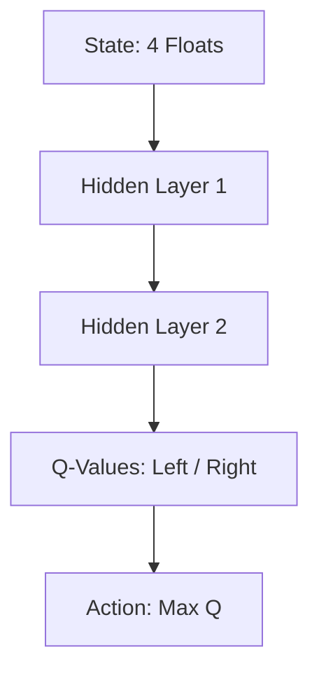

# Gymnasium Control Tasks: CartPole

The CartPole environment is a classic control problem where the goal is to balance a pole on a cart by moving the cart left or right.

## Task Details
- **State Space:** Cart Position, Cart Velocity, Pole Angle, Pole Angular Velocity.
- **Action Space:** Move Left (0), Move Right (1).
- **Reward:** +1 for every timestep the pole remains upright.

## DQN Application
CartPole is often used as a "Hello World" for DQN because it has a continuous state space but a small discrete action space, making it easy to visualize and debug.

## Diagram

## References
- [OpenAI Gym (2016)](https://arxiv.org/abs/1606.01540)
- [Gymnasium Documentation](https://gymnasium.farama.org/environments/classic_control/cart_pole/)

[Back to README](../README.md)
