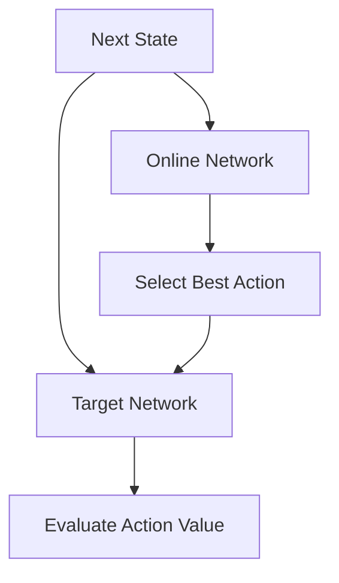

# Double DQN (DDQN)

Double DQN was proposed to solve the overestimation bias problem in standard DQN. Standard DQN often overestimates action values because it uses the same values both to select and to evaluate an action.

## Key Formula
Instead of:
$Y_t^{DQN} = R_{t+1} + \gamma \max_a Q(S_{t+1}, a; \theta_t^-)$

DDQN uses:
$Y_t^{DoubleDQN} = R_{t+1} + \gamma Q(S_{t+1}, \text{argmax}_a Q(S_{t+1}, a; \theta_t); \theta_t^-)$

## Architecture Diagram

## References
- [Deep Reinforcement Learning with Double Q-learning (2015)](https://arxiv.org/abs/1509.06461)

[Back to README](../README.md)
