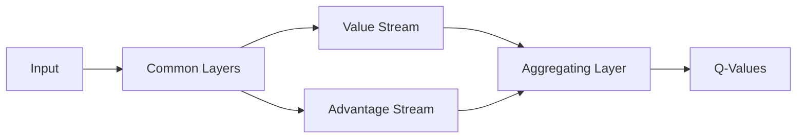

# Dueling DQN

The Dueling Network architecture represents the Q-function by decomposing it into two separate streams: one for the state value function and another for the state-dependent advantage function.

## Key Innovations
- **Value Stream ($V$):** Estimates how good it is to be in a certain state.
- **Advantage Stream ($A$):** Estimates the relative importance of each action.

## Architecture Diagram

## References
- [Dueling Network Architectures for Deep Reinforcement Learning (2015)](https://arxiv.org/abs/1511.06581)

[Back to README](../README.md)
